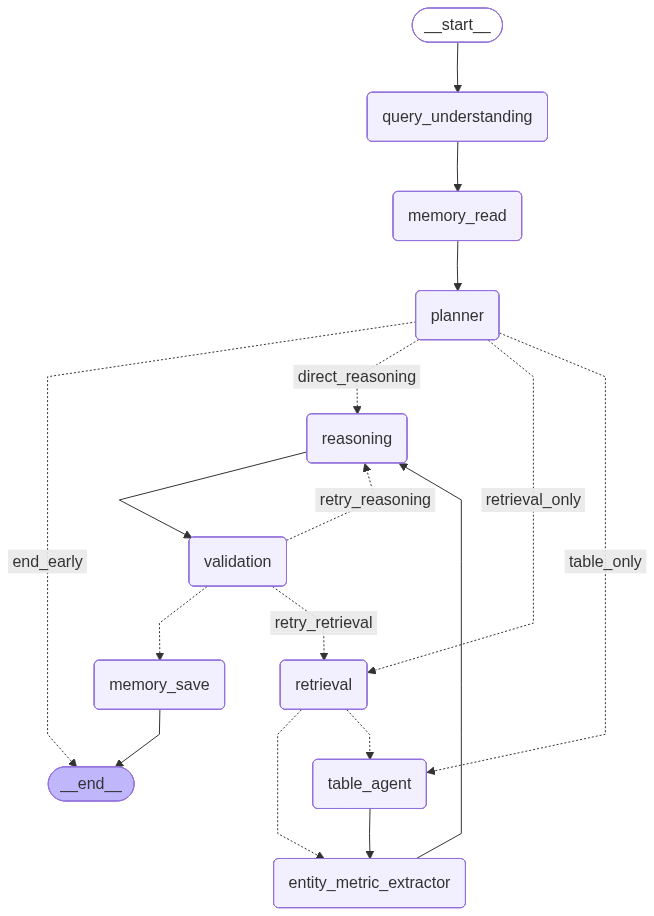

# PdfAgent — Agentic RAG over any PDF

> Grounded answers from your PDFs, with source citations.

[](https://www.python.org/)
[](https://langchain-ai.github.io/langgraph/)
[](https://www.langchain.com/)
[](https://github.com/facebookresearch/faiss)
[](https://fastapi.tiangolo.com/)
[](https://ollama.com/)
[](#license)

PdfAgent is a multi-agent Retrieval-Augmented Generation system that answers questions about any PDF — research reports, ESG / sustainability disclosures, contracts, manuals, financial filings — with grounded, cited responses. Drop a PDF into the browser UI and start asking.

Built on **LangGraph**, **Ollama**, and **FAISS**. Ingests PDFs (text + tables + images), builds a hierarchical retrieval index, and answers questions through a multi-agent workflow with corrective feedback loops (CRAG) and a defense-in-depth hallucination stack (pre-synthesis structured fact extraction + deterministic entity↔value attribution verification + citation verification + claim-level faithfulness + cross-chunk contradiction detection + deterministic arithmetic verification).

---

## Browser UI


One-click PDF upload (replaces the indexed corpus with live progress), streamed agent-by-agent answers with quality pills (Confidence / Faithfulness / Citation coverage / Attribution), and an inspectable Response Details panel with retrieved chunks, generated SQL, token usage per agent, and execution trace. See [Using PdfAgent](#using-pdfagent) below.

---

## Workflow



The planner decides **per query**:
1. **In-scope check** — greetings, smalltalk, or off-topic queries short-circuit straight to `END` with a polite redirect.
2. **Context source** — RAG only, Table only, or **both** (richer mixed context).
3. **RAG strategy** — `standard` / `raptor_global` / `map_reduce`.
4. **Complexity tier** — `trivial` / `moderate` / `complex`, used to gate the heavier verifier/extractor passes on cheap single-fact lookups.

Between retrieval/table_agent and reasoning, an **entity-metric extractor** pulls atomic `(entity, metric, value, unit)` facts from the retrieved chunks + SQL rows. The Reasoning prompt is then told to source EVERY numerical claim from this facts table — and a deterministic **attribution verifier** checks the final answer against the same table, catching cross-row contamination (e.g. pairing Penang's kWh with Mexico's site name) that LLM-judge verifiers miss.

---

## Features

- **Multi-modal ingestion** — text + tables (extracted into SQLite) + images (OCR via EasyOCR + vision-LLM captions, optional)
- **Parent-child chunking** with **Anthropic-style contextual retrieval** (chunks prepended with 2-3 sentence context)
- **Hybrid retrieval** — BM25 (sparse) + FAISS (dense, cosine via normalized inner product) merged with Reciprocal Rank Fusion
- **Cross-encoder reranking** (`ms-marco-MiniLM-L-6-v2`) for precision filtering
- **Query decomposition** — compound questions split into 2-4 sub-questions; retrieval fans out per sub-question with **per-sub-question scoped evidence** carried into the reasoning prompt
- **Metadata-aware retrieval** — year / document mentions filter the candidate pool before reranking, with graceful fallback
- **RAPTOR tree** — recursive K-Means clustering + LLM summarization, 3 levels deep, for global queries
- **Map-Reduce** strategy for exhaustive aggregation (`"list ALL initiatives..."`)
- **Schema-aware NL → SQL** for tabular queries, with SELECT-only safety enforcement
- **Pre-synthesis structured fact extraction** ([agents/entity_metric_extractor.py](agents/entity_metric_extractor.py)) — one LIGHT LLM call (skipped for `complexity_tier="trivial"` or when `attribution_enabled=False`) extracts atomic `(entity, metric, value, unit, source_chunk_id)` facts from retrieved chunks; SQL rows convert deterministically with no LLM. The Reasoning prompt is told to source ALL numbers from this facts table — eliminating row-alignment drift that LLM-judge verifiers can't catch
- **Specialized agents** with Pydantic structured output — query understanding, planner, retrieval, table (NL→SQL), entity-metric extractor, reasoning, validation, plus verifier agents (citation, attribution, contradiction, calculator) and memory read/save
- **Hallucination defense (CRAG + four hard overrides)** — deterministic entity↔value attribution verification, extractive citation verification, claim-level faithfulness scoring (now merged into validation in one LLM call), cross-chunk contradiction detection, and deterministic arithmetic verification of delta tables; any of these can force a rewrite if below threshold, with targeted `rewrite_hint` fed back into the next reasoning pass
- **Per-source diversity cap** — `rerank_per_source_max` limits how many chunks from the same `(document, page)` survive the post-rerank top-K so a long narrative section can't crowd out other entities; aggregation queries also get a wider `rerank_top_k_aggregation` budget
- **Optional cross-encoder reranker** — toggleable via `rerank_enabled`; when off, retrieval uses the top-K of hybrid RRF (no precision pass, no model download)
- **Neighbor-page parent expansion** — when a top-K reranked child sits next to a page that hybrid search also surfaced, pull that page's parents into context for richer continuity
- **Auto-detected context window** — queries Ollama `/api/show` for the model's true `context_length` and passes `num_ctx` explicitly (Ollama otherwise defaults to 2048 even on 128K-capable models); prompt slots (`text_context`, `table_context`, `map_reduce_context`, `memory_context`) are sized as **percentages** of the available window so budgets scale automatically when you swap models or change `MAX_CONTEXT_TOKENS`
- **Executive-friendly answers** — adaptive markdown: lead paragraph + organic section headers (chosen from the query + evidence, not a fixed template), bulleted entity lists with bolded names, optional `**Bottom line:**` callout when there's a clean one-line answer, required 5-column delta table for YoY / multi-period comparisons (the calculator verifies the Δ columns afterwards)
- **SSE streaming** — `/query/stream` emits one event per agent completion so the UI shows live progress instead of a spinner
- **Pre-flight smalltalk shortcut** — obvious greetings bypass the workflow entirely (zero LLM calls)
- **Memory** — SqliteSaver checkpointer (short-term) + Store (long-term, per-user)
- **Observability** — local JSONL tracer at `data/traces/` + per-agent execution trace in the API response
- **Three interfaces** — FastAPI REST API, browser chat UI (light theme + live progress + markdown tables), CLI

---

## Quick Start

Three steps from `pip install` to chatting with a PDF — no clone, no preprocessing CLI required.

```bash
# 1. Install — PyPI (once a release is tagged; see ./PUBLISHING.md)
pip install agentic-rag-pdf

# …or install the latest commit directly from GitHub
pip install git+https://github.com/bhagatdas/PdfAgent-Agentic-RAG-over-any-PDF.git

# 2. Install + start Ollama (https://ollama.com/download), then pull models
ollama pull mxbai-embed-large
ollama signin                       # only if using cloud models like gpt-oss:120b-cloud

# 3. Launch the UI (creates a data/ folder in the current working directory)
pdfagent
```

> The PyPI distribution name is **`agentic-rag-pdf`** (the bare `pdfagent` name is owned by an unrelated project). The console command shipped by the wheel is still `pdfagent`.

Open **http://localhost:8000** → click **Upload PDF** → drop a file → wait for the live progress to finish → ask questions. No CLI ingestion step needed.

`pdfagent --host 0.0.0.0 --port 8080 --reload` for custom bind / dev auto-reload. The full LangGraph CLI is also installed as `pdfagent-cli` (`pdfagent-cli ingest`, `pdfagent-cli query "..."`, `pdfagent-cli chat`, `pdfagent-cli schema`).

### Optional — clone for development

```bash
git clone https://github.com/bhagatdas/PdfAgent-Agentic-RAG-over-any-PDF.git
cd PdfAgent-Agentic-RAG-over-any-PDF
pip install -e .                    # editable install
pdfagent --reload                   # or: uvicorn app:app --reload --port 8000
```

Override defaults via a `.env` file in your working directory — see [config/settings.py](config/settings.py) for the full list (`OLLAMA_MODEL_LIGHT` / `_HEAVY` / `_VISION` default to `gpt-oss:120b-cloud`; `OLLAMA_MODEL_EMBED` defaults to `mxbai-embed-large`).

---

## Using PdfAgent

**Upload a PDF.** Click **Upload PDF** in the sidebar. The modal pre-flights Ollama (`GET /ollama/health`) and, if anything is missing (daemon not running, required model not pulled, cloud model not signed-in), shows per-OS install steps + the exact `ollama pull` / `ollama signin` commands + a **Retry check** button — you fix the environment without leaving the page. Drop a single PDF and click **Wipe & Ingest** — this deletes the previous corpus (FAISS, BM25, SQLite tables, checkpoints, images, traces, the previous PDF, response log; the cross-encoder cache is preserved) and runs the full pipeline live: `Extracting text → Chunking → Tables → Images + OCR + captions → Contextualizing → Indexing → BM25 → RAPTOR → Schema catalog → Complete`. A success block shows pages / chunks / tables / images / RAPTOR nodes / seconds.

**Ask questions.** Type into the chat (Enter to send, Shift+Enter for newline). Each agent streams as it completes: `Understanding → Memory → Planner → Retrieval (expandable to see every chunk + scores + parent context) → Table Agent (if needed) → Facts extraction → Reasoning → Validation → Memory save`. Quality pills (Confidence / Faithfulness / Citation coverage / Attribution) show under the answer; dedicated callouts surface contradictions, attribution mismatches, and the facts table the Reasoning agent was forced to source from.

**Inspect.** The grid icon top-right toggles Response Details: sources, generated SQL, retrieved chunks, per-agent token usage, execution trace, query metadata.

**Replace the indexed PDF anytime** by clicking **Upload PDF** again — the wipe is automatic. **+ New Conversation** clears chat state but keeps the indexed PDF.

CLI ingestion is still available if you'd rather not use the UI: drop files into `data/pdfs/` then `python preprocessing.py --clear`.

---

## CLI

```bash
# Ingestion (offline) — choose either entry point; both call the same pipeline
python preprocessing.py --clear                       # standalone preprocessor
python preprocessing.py --clear --no-vision           # skip image captions
python preprocessing.py --clear --no-images           # skip all image extraction (fastest)
python main.py ingest                                 # alternative: via main.py

# Querying
python main.py query "What are Scope 1 emissions?"    # one-shot
python main.py chat                                   # interactive REPL
python main.py schema                                 # print schema catalog

# Tables-only maintenance (does NOT touch FAISS / BM25 / RAPTOR)
python reextract_tables.py                            # drop SQLite tables + re-scan PDFs
python inspect_tables.py                              # list every table + 5-row sample
python inspect_tables.py <table_name>                 # full dump + CSV export
python inspect_tables.py --sql "SELECT ..."           # ad-hoc query

# Wipe preprocessed data (preserves source PDFs + cross-encoder model cache)
python wipe_data.py                                   # interactive
python wipe_data.py --yes                             # non-interactive (CI / scripts)

# Evaluation — unified entry point (subcommands: agentic / retrieval / adversarial / gold / all)
python -m evaluation.run_all all                      # full suite
python -m evaluation.run_all agentic --limit 20       # end-to-end answer quality vs QNA_data/
python -m evaluation.run_all retrieval --k 1 3 5 10   # dense vs hybrid vs hybrid+rerank
python -m evaluation.run_all adversarial              # robustness / refusal / multi-hop / citation
python -m evaluation.run_all gold --n-local 40 --n-global 10   # build the retrieval gold dataset

# Individual evaluators still work standalone:
python -m evaluation.agentic_eval
python -m evaluation.retrieval_eval
python -m evaluation.adversarial_eval
```

---

## REST API

| Method | Path                    | Purpose                                                                                |
|:------:|:------------------------|:---------------------------------------------------------------------------------------|
| `GET`  | `/`                     | Serve chat UI                                                                          |
| `GET`  | `/health`               | Vector store doc count + table count                                                   |
| `GET`  | `/ollama/health`        | Probe Ollama reachability + required-vs-present models + per-OS install instructions   |
| `POST` | `/query`                | Run the full pipeline; returns answer + citations + trace + duration (JSON)            |
| `POST` | `/query/stream`         | Same pipeline, streamed via SSE: one `event: step` per agent + final `event: complete` |
| `POST` | `/upload-ingest/stream` | Single-PDF wipe-then-ingest (multipart upload + SSE progress) — what **Upload PDF** uses |
| `POST` | `/ingest`               | Trigger preprocessing on whatever's already in `data/pdfs/`                            |
| `POST` | `/upload`               | Save uploaded PDF to `data/pdfs/` (no ingestion / wipe)                                |
| `GET`  | `/schema`               | Return schema catalog string                                                           |

Example (JSON):

```bash
curl -X POST http://localhost:8000/query \
  -H "Content-Type: application/json" \
  -d '{"query":"How did Scope 1 emissions change year over year and what drove the change?", "user_id":"alice"}'
```

Example (SSE — what the web UI uses):

```bash
curl -N -X POST http://localhost:8000/query/stream \
  -H "Content-Type: application/json" \
  -d '{"query":"What are Honeywell'\''s key sustainability initiatives?"}'
# event: step
# data: {"node":"query_understanding","label":"Understanding your question","status":"complete",...}
# ...
# event: complete
# data: {"answer":"...","citations":[...],"faithfulness_score":1.0,...}
```

---

## Architecture

```
PDF -> text + tables + images
     -> parent/child chunks -> contextualize -> embed -> FAISS
     -> RAPTOR hierarchical summaries
     -> SQLite table store + schema catalog

Query -> [pre-flight smalltalk shortcut?] -> END (if obvious greeting, 0 LLM calls)
     -> Understanding -> Memory Read -> Planner
              |
       +-- end_early (greetings / off-topic) ---------------------> END
       +-- Retrieval (RAG)        -+
       +-- Table Agent (SQL)       +-> Entity-Metric Extractor (facts table)
       +-- Both (RAG + Table)     -+        |
                                            v
                                   Reasoning (sources numbers from facts table)
                                            |
                                            +-> citation verifier (extractive)
                                            +-> contradiction detector (cross-chunk)
                                            +-> calculator (delta-table arithmetic)
                                            +-> attribution verifier (deterministic entity↔value)
                                            |
                                            v
                                   Validation (CRAG + grounding + claim faithfulness
                                                merged into ONE LLM call;
                                                hard overrides on coverage / faithfulness / attribution)
                                            |
                                            +-- pass --> Memory Save --> END
                                            +-- retry retrieval / reasoning (<=2x)
                                                with targeted rewrite_hint when
                                                attribution failed last pass
```

For deeper dives, read the agents and routers directly: [agents/](agents/), [graph/workflow.py](graph/workflow.py), [graph/state.py](graph/state.py).

### Hallucination defense

Seven layers stack to keep answers grounded:

1. **Strict prompt** — `agents/reasoning.py::REASONING_PROMPT` forces context-only synthesis, with two exact refusal strings for out-of-scope / not-in-context, plus explicit rules for compound queries (answer-what-you-can, gap-what-you-can't) so partial answers replace blanket refusals.
2. **Entity-metric extractor** ([agents/entity_metric_extractor.py](agents/entity_metric_extractor.py)) — runs BEFORE reasoning. One LIGHT LLM call extracts atomic `(entity, metric, value, unit, source_chunk_id)` facts from retrieved chunks; SQL rows convert deterministically. The Reasoning prompt is told to source ALL numbers from this table — eliminating row-alignment drift. Skipped on `complexity_tier="trivial"` or when `attribution_enabled=False`.
3. **Citation verifier** ([agents/citation_verifier.py](agents/citation_verifier.py)) — extractive check that every `[Doc, Page N]` marker resolves to an actually-retrieved chunk. Coverage < threshold → forced rewrite.
4. **Attribution verifier** ([agents/attribution_verifier.py](agents/attribution_verifier.py)) — deterministic post-LLM check (no LLM call). For every numeric mention in the answer, finds the bound entity by token-proximity scan and looks up the `(entity, value, unit)` triple in the facts table. Classifies failures as `wrong_entity` / `no_supporting_fact` / `unit_mismatch` / `value_mismatch`. Score < threshold → forced rewrite, with a targeted `rewrite_hint` listing the specific failures.
5. **Faithfulness check (merged into validation)** ([agents/validation.py](agents/validation.py)) — claim-level decomposition runs inside the validation LLM call (previously a separate `faithfulness_checker.py`, merged for ~1/2 the token spend). Decomposes the answer into atomic claims and judges each `yes/partial/no` against retrieved chunks. Score < threshold → forced rewrite.
6. **Contradiction detector** ([agents/contradiction_detector.py](agents/contradiction_detector.py)) — one structured LLM call scans the retrieved chunks for numeric / factual conflicts about the same metric, year, or scope (chunks vs. each other, not answer vs. chunks). Surfaced in a dedicated UI callout.
7. **Calculator** ([agents/calculator.py](agents/calculator.py)) — deterministic post-pass that parses every `| Metric | A | B | Δ absolute | Δ relative |` delta table in the answer, recomputes the last two columns, and rewrites the LLM's values if they're off by more than the tolerance. No LLM call, no new dependencies.

Thresholds in [config/settings.py](config/settings.py): `citation_coverage_threshold=0.5`, `faithfulness_threshold=0.7`, `attribution_threshold=0.9`, `attribution_value_tolerance=0.005`.

---

## Tech stack

| Layer | Tech |
|---|---|
| Orchestration | LangGraph 1.0+, LangChain 0.3+ |
| LLM | Ollama (gpt-oss:120b-cloud for light/heavy/vision, mxbai-embed-large for embeddings) |
| Vector DB | FAISS (IndexFlatIP over L2-normalized vectors = cosine similarity) |
| Sparse retrieval | rank_bm25 |
| Reranker | sentence-transformers cross-encoder (`ms-marco-MiniLM-L-6-v2`) |
| Tables | SQLite + pandas |
| PDF | PyMuPDF (fitz) |
| OCR | EasyOCR (pip-installable) |
| API | FastAPI + Uvicorn (SSE streaming) |
| Tracing | Local JSONL (`utils/tracing.py`) — writes to `data/traces/` |
| Eval | Unified runner (`evaluation/run_all.py`) over agentic / retrieval / adversarial sub-evaluators; RAGAS removed |

---

## Project Structure

```
agentic_rag/
├── main.py                       # CLI entry (ingest / query / chat / schema)
├── app.py                        # FastAPI REST API (+ /query/stream SSE)
├── preprocessing.py              # single-file PDF pipeline — text/tables/images,
│                                 # chunking, contextualization, RAPTOR, schema catalog
├── reextract_tables.py           # drop SQLite tables + re-scan PDFs (no FAISS rebuild)
├── inspect_tables.py             # CLI inspector for data/tables.db
├── wipe_data.py                  # clear preprocessed data; preserve PDFs + model cache
├── config/settings.py            # Pydantic Settings
├── utils/                        # LLM router, embeddings, logging, local tracer
│   └── tracing.py                # local JSONL tracer (replaces LangSmith)
├── retrieval/
│   ├── vector_store.py           # FAISS (IndexFlatIP, cosine via normalization)
│   ├── bm25_retriever.py
│   ├── hybrid.py                 # RRF fusion
│   └── reranker.py               # cross-encoder
├── storage/
│   ├── sql_store.py              # SQLite (SELECT-only at runtime)
│   └── schema_manager.py
├── graph/
│   ├── state.py                  # AgentState + Pydantic models
│   ├── checkpointer.py           # SqliteSaver + InMemoryStore
│   └── workflow.py               # LangGraph StateGraph + routers + smalltalk shortcut
├── agents/
│   ├── query_understanding.py    # + mentioned_documents extraction
│   ├── planner.py                # decides RAG / Table / Both / End-Early + sub-questions + complexity_tier
│   ├── memory_agent.py
│   ├── retrieval.py              # standard / raptor / map-reduce + metadata pre-filter + neighbor-page expansion
│   ├── table_agent.py            # NL -> SQL
│   ├── entity_metric_extractor.py # pre-synthesis (entity, metric, value, unit) fact extraction
│   ├── reasoning.py              # synthesis + citation verifier + contradiction + calculator + attribution verifier
│   ├── citation_verifier.py      # extractive [Doc, Page] check
│   ├── attribution_verifier.py   # deterministic entity↔value attribution check against facts table
│   ├── contradiction_detector.py # cross-chunk numeric / factual conflict scan
│   ├── calculator.py             # deterministic arithmetic verifier for delta tables
│   └── validation.py             # CRAG + claim-level faithfulness in one LLM call + hard overrides
├── evaluation/                   # unified eval suite (run_all.py orchestrates the rest)
│   ├── run_all.py                # entry point: agentic / retrieval / adversarial / gold / all
│   ├── agentic_eval.py           # end-to-end answer quality vs QNA_data/*.json (LLM-judge + cosine)
│   ├── retrieval_eval.py         # dense vs hybrid vs hybrid+rerank on gold_retrieval.jsonl
│   ├── adversarial_eval.py       # robustness / refusal / multi-hop / citation fidelity
│   ├── build_gold_dataset.py     # LLM-synthesized retrieval gold set generator
│   ├── response_logger.py        # shared per-query trace logger
│   ├── adversarial_questions.jsonl
│   └── gold_retrieval.jsonl
├── QNA_data/                     # (untracked) human-labelled question/answer JSONs for agentic eval
├── static/                       # chat UI (light theme + live SSE progress + markdown tables)
└── data/                         # (gitignored) PDFs, FAISS, tables.db, traces, logs
```

---

## Configuration

All settings via `.env` (full list with defaults in [config/settings.py](config/settings.py)):

| Group         | Keys |
|---|---|
| Ollama        | `OLLAMA_BASE_URL`, `OLLAMA_MODEL_LIGHT`, `OLLAMA_MODEL_HEAVY`, `OLLAMA_MODEL_VISION`, `OLLAMA_MODEL_EMBED` |
| Storage       | `FAISS_PERSIST_DIR`, `SQLITE_TABLE_DB`, `CHECKPOINT_DB`, `DATA_DIR`, `PDF_DIR`, `IMAGE_DIR` |
| PDF extractor | `PDF_EXTRACTOR=pymupdf4llm` (alt: `layout` / `basic`) |
| Chunking      | `CHUNK_SIZE_CHILD=400`, `CHUNK_SIZE_PARENT=1600`, `CHUNK_OVERLAP=50` |
| Retrieval     | `RETRIEVAL_TOP_K=20`, `RERANK_TOP_K=4`, `RERANK_TOP_K_AGGREGATION=10`, `RERANK_PER_SOURCE_MAX=2`, `RERANK_ENABLED=false`, `ENABLE_NEIGHBOR_PAGE_EXPANSION=true`, `NEIGHBOR_PAGE_WINDOW=1` |
| RAPTOR        | `RAPTOR_CLUSTER_SIZE=10`, `RAPTOR_MAX_LEVELS=3` |
| Memory        | `SHORT_TERM_MAX_MESSAGES=20`, `LONG_TERM_MAX_ITEMS=200` |
| Context window | `MAX_CONTEXT_TOKENS=131072` (auto-clamped to model max), `OUTPUT_TOKENS_RESERVED=4096`, `PROMPT_OVERHEAD_TOKENS=3000`, `CTX_SHARE_TEXT=0.75`, `CTX_SHARE_TABLE=0.12`, `CTX_SHARE_MAP_REDUCE=0.10`, `CTX_SHARE_MEMORY=0.03`, `CHARS_PER_TOKEN=4.0` |
| Hallucination | `CITATION_COVERAGE_THRESHOLD=0.5`, `CITATION_FUZZY_RATIO=0.85`, `FAITHFULNESS_THRESHOLD=0.7`, `FAITHFULNESS_MAX_CLAIMS=10` |
| Attribution   | `ATTRIBUTION_ENABLED=true`, `ATTRIBUTION_MAX_FACTS=40`, `ATTRIBUTION_THRESHOLD=0.9`, `ATTRIBUTION_ENTITY_FUZZY_RATIO=0.85`, `ATTRIBUTION_VALUE_TOLERANCE=0.005`, `ATTRIBUTION_PROXIMITY_TOKENS=15` |
| Tracing       | `LOCAL_TRACING=true` (writes `data/traces/trace_<date>.jsonl`) |

---

## Example Query Flows

**Aggregation:** `"List all ESG initiatives mentioned in the Honeywell report"`
1. Understanding → `scope=aggregation`, `entities=["ESG initiatives", "Honeywell"]`
2. Planner → `strategy=map_reduce`, `use_rag=True`, `use_table=False`
3. Retrieval → per-chunk LLM extraction across the corpus, dedup
4. Reasoning → enumerated answer with `[doc, page]` citations
5. Validation → `pass` → memory save → END

**Mixed (number + narrative):** `"How did Scope 1 emissions change YoY and what drove the change?"`
1. Planner → `use_rag=True` AND `use_table=True`
2. Retrieval → standard hybrid search for narrative context
3. Table Agent → generates SQL on extracted emissions table
4. Reasoning → fuses both sources, cites narrative chunk + table row
5. Validation → `pass` → END

**Smalltalk:** `"hi"` → Planner short-circuits to `END` with a polite redirect. No retrieval, no LLM reasoning cost.

---

## Documentation

- **[workflow.png](workflow.png)** — rendered LangGraph state diagram
- **[workflow.mmd](workflow.mmd)** — editable Mermaid source
- Agent implementations live in [agents/](agents/); routing logic in [graph/workflow.py](graph/workflow.py).

---

## License

Proprietary — see repository owner.

---

*Built by [Bhagat Labs](https://github.com/bhagatdas).*
